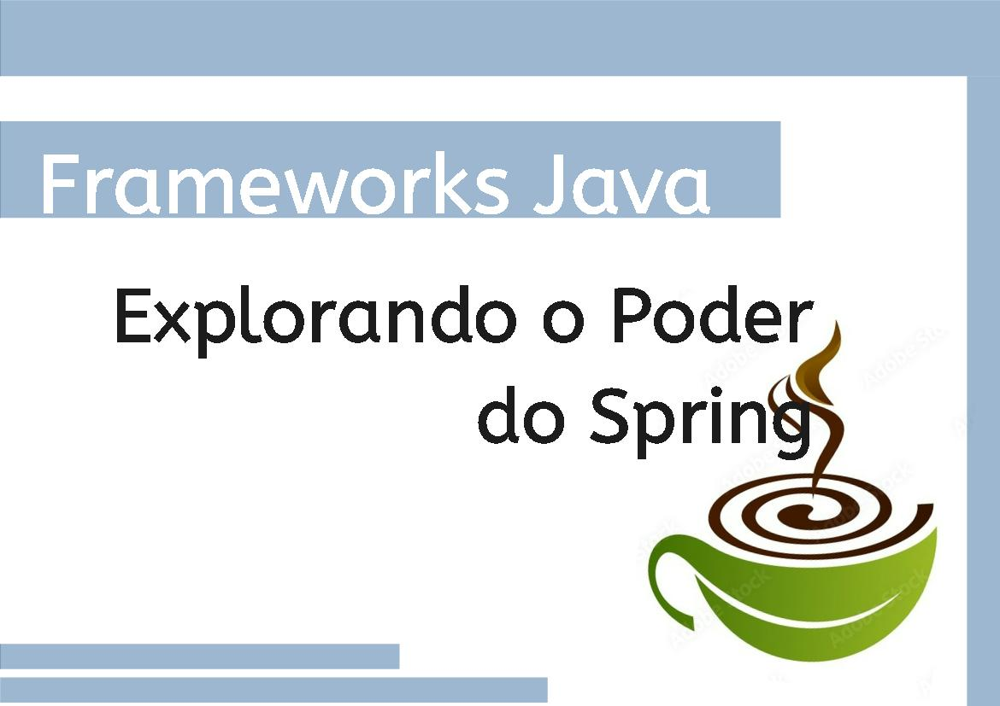

# Frameworks Java: Explorando o Poder do Spring
Não dá pra falar de Java sem mencionar seus incríveis frameworks, né? Dentre os mais destacados, o Spring Framework se sobressai como uma ferramenta essencial para o desenvolvimento de aplicações modernas e robustas. Vamos explorar suas bibliotecas, componentes e ferramentas que tornam a vida dos desenvolvedores mais fácil e produtiva.

## Introdução ao Spring Framework
O Spring Framework é um framework abrangente que simplifica o desenvolvimento de aplicações Java. Ele fornece uma estrutura consistente para criar aplicações que podem ser facilmente testadas, mantidas e evoluídas. Desde sua criação, o Spring tem se destacado pela flexibilidade e pelo suporte a vários paradigmas de programação.

### Injeção de Dependência e Contêiner IoC
A _injeção de dependência_ é o coração do Spring. Ela permite que objetos sejam criados e gerenciados pelo contêiner IoC (Inversion of Control), promovendo uma maior modularidade e testabilidade. Com essa abordagem, a complexidade da criação e ligação de dependências é drasticamente reduzida.

### Programação Orientada a Aspectos (AOP)
A Programação Orientada a Aspectos permite que funcionalidades transversais, como logging e segurança, sejam implementadas de forma isolada do código principal. Isso resulta em um código mais limpo e fácil de manter. O Spring AOP é uma ferramenta poderosa que facilita a implementação desses aspectos de maneira transparente.

### Spring MVC e Desenvolvimento Web
O *Spring MVC* (Model-View-Controller) é um módulo fundamental para o desenvolvimento de aplicações web. Ele fornece uma estrutura robusta para construir aplicações web flexíveis e escaláveis. O Spring MVC facilita o mapeamento de URLs para métodos de controle, gestão de sessões, validação de dados e muito mais.

### Spring Boot: Aceleração de Desenvolvimento
O *Spring Boot* é uma extensão do Spring que simplifica a configuração e inicialização de novas aplicações. Ele elimina a necessidade de configurações complexas e permite que os desenvolvedores comecem a trabalhar rapidamente. Com Spring Boot, você pode criar aplicações stand-alone, prontas para produção, com configuração mínima.

### Spring Data: Simplificando o Acesso a Dados
O Spring Data é um projeto do Spring que visa simplificar o acesso a dados, proporcionando uma abstração consistente sobre diferentes tecnologias de persistência. Ele suporta diversos bancos de dados, desde SQL tradicionais até NoSQL modernos, facilitando a implementação de repositórios e operações de CRUD.

### Spring Security: Protegendo Aplicações
A segurança é uma preocupação crítica para qualquer aplicação. O Spring Security oferece uma solução abrangente para proteger suas aplicações contra ameaças comuns, como autenticação e autorização. Ele integra-se facilmente com outras partes do Spring e pode ser personalizado para atender às necessidades específicas de segurança da sua aplicação.

### Spring Cloud: Microservices e Arquiteturas Distribuídas
Com a crescente adoção de arquiteturas de microservices, o Spring Cloud surge como uma solução poderosa para criar sistemas distribuídos. Ele oferece ferramentas para configuração distribuída, descoberta de serviços, balanceamento de carga, circuit breakers, e muito mais, facilitando a construção de aplicações resilientes e escaláveis.

## Considerações Finais
O Spring Framework é, sem dúvida, uma das ferramentas mais poderosas no arsenal de um desenvolvedor Java. Com suas inúmeras funcionalidades e extensões, ele continua a ser uma escolha popular para criar aplicações modernas, robustas e escaláveis. Seja você um desenvolvedor iniciante ou experiente, o Spring oferece os recursos e a flexibilidade necessários para enfrentar qualquer desafio de desenvolvimento.
